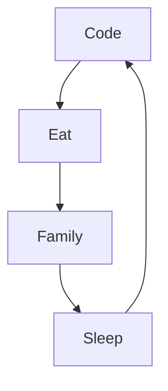

### Hi there 👋

- 🌱 I’m currently learning front end developement
- 💬 Ask me about what you want to know about me or my job
- 📫 How to reach me: johann.hercovitz@gmail.com
- ⚡ Fun fact: It's been few years my wife told me to work in web because I've always been comfortable in informatic. Finally at 37 years old, I decided to listen to her 😄...  

### Languages and tools:

    

### My daily routine:

### My Github stats:

